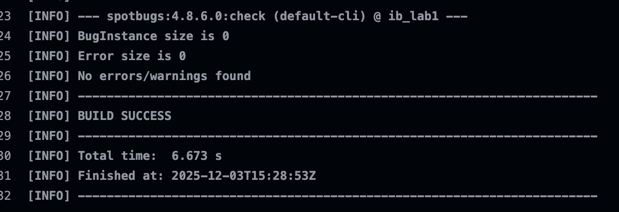
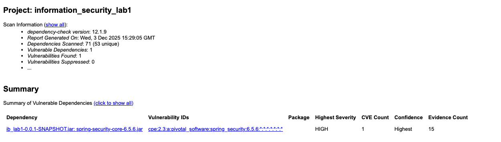
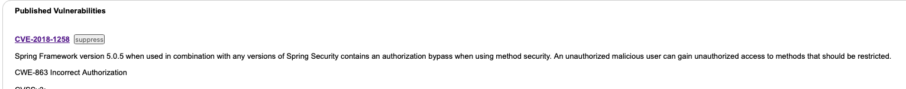
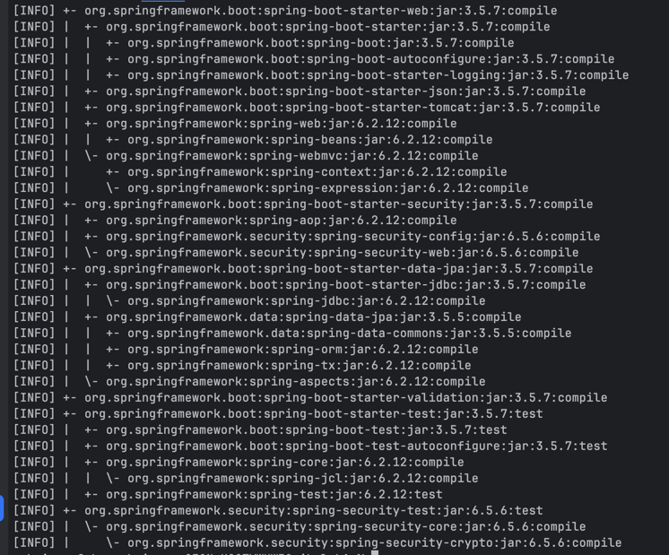

# Information Security Lab 1

### Аутентификация

#### 1. Регистрация пользователя

**POST** `/auth/register`

Регистрирует нового пользователя в системе.

**Request Body:**
```json
{
  "username": "john_doe",
  "password": "securePassword123"
}
```

**Валидация:**
- `username`: обязательное поле, минимум 3 символа, максимум 50 символов
- `password`: обязательное поле, минимум 6 символов

**Response (200 OK):**
```json
"User registered successfully!"
```

**Response (400 Bad Request):**
```json
"Error: Username is already taken!"
```

#### 2. Вход в систему (Аутентификация)

**POST** `/auth/login`

Аутентифицирует пользователя и возвращает JWT токен.

**Request Body:**
```json
{
  "username": "john_doe",
  "password": "securePassword123"
}
```

**Response (200 OK):**
```json
{
  "token": "eyJhbGciOiJIUzI1NiIsInR5cCI6IkpXVCJ9...",
  "type": "Bearer"
}
```

**Response (401 Unauthorized):**
Возвращается при неверных учетных данных.

### Защищенные эндпоинты

Все эндпоинты ниже требуют аутентификации через JWT токен. Токен должен быть передан в заголовке `Authorization` в формате `Bearer <token>`.

#### 3. Получение данных

**GET** `/api/data`

Возвращает список всех пользователей и приветственное сообщение для аутентифицированного пользователя.

**Headers:**
```
Authorization: Bearer <your-jwt-token>
```

**Response (200 OK):**
```json
{
  "message": "Hello john_doe!",
  "users": [
    {
      "id": 1,
      "username": "john_doe"
    },
    {
      "id": 2,
      "username": "jane_smith"
    }
  ],
  "timestamp": 1703123456789
}
```

#### 4. Создание поста

**POST** `/api/posts`

Создает новый пост от имени аутентифицированного пользователя.

**Headers:**
```
Authorization: Bearer <your-jwt-token>
Content-Type: application/json
```

**Request Body:**
```json
{
  "title": "Мой первый пост",
  "content": "Содержимое поста может быть до 1000 символов."
}
```

**Валидация:**
- `title`: обязательное поле, от 1 до 255 символов
- `content`: обязательное поле, от 1 до 1000 символов

**Response (200 OK):**
```json
{
  "message": "Post created successfully",
  "id": 1
}
```

#### 5. Получение всех постов

**GET** `/api/posts`

Возвращает список всех постов, отсортированных по дате создания (от новых к старым).

**Headers:**
```
Authorization: Bearer <your-jwt-token>
```

**Response (200 OK):**
```json
[
  {
    "id": 2,
    "title": "Второй пост",
    "content": "Содержимое второго поста",
    "author": "jane_smith",
    "createdAt": "2024-01-15T10:30:00"
  },
  {
    "id": 1,
    "title": "Мой первый пост",
    "content": "Содержимое поста может быть до 1000 символов.",
    "author": "john_doe",
    "createdAt": "2024-01-15T09:15:00"
  }
]
```

## Реализованные меры защиты

### 1. Защита от SQL-инъекций (SQL Injection)

**Использование параметризованных запросов через Spring Data JPA / Hibernate:**

1. **Автоматическая защита на уровне ORM:**
   - Все запросы выполняются через Spring Data JPA репозитории (`UserRepository`, `PostRepository`)
   - Hibernate автоматически использует **Prepared Statements** с параметризованными запросами
   - Пользовательский ввод никогда не конкатенируется напрямую в SQL-запросы

2. **Дополнительная защита:**
   - Валидация входных данных через Jakarta Bean Validation (`@NotBlank`, `@Size`)
   - Ограничение длины полей на уровне модели данных


### 2. Защита от XSS (Cross-Site Scripting)

**Явное экранирование пользовательских данных с помощью OWASP Encoder:**

1. **Использование библиотеки OWASP Encoder:**
   - Все пользовательские данные, возвращаемые в ответах API, экранируются через `Encode.forHtml()`
   - Это преобразует потенциально опасные символы (`<`, `>`, `&`, `"`, `'`) в HTML-сущности

2. **Дополнительная защита:**
   - Валидация входных данных на уровне DTO (`@NotBlank`, `@Size`)
   - Spring Boot автоматически экранирует данные в JSON-ответах (дополнительный уровень защиты)

### 3. Защита от Broken Authentication

1. **Хэширование паролей: использование BCrypt**

2. **Генерация JWT токена при успешном входе**

3. **AuthTokenFilter - фильтр для проверки токенов на всех защищенных эндпоинтах**

4. **Конфигурация безопасности - настройка правил доступа**

## CI/CD и проверки безопасности

Проект включает автоматические проверки безопасности в GitHub Actions:

### SAST (Static Application Security Testing)

**SpotBugs** - статический анализ кода на потенциальные уязвимости и ошибки:
- Запускается автоматически при каждом push и pull request
- Проверяет код на наличие известных паттернов уязвимостей
- Отчеты доступны в артефактах GitHub Actions

### SCA (Software Composition Analysis)

**OWASP Dependency-Check** - анализ зависимостей проекта на известные уязвимости:
- Сканирует все зависимости Maven на наличие известных CVE
- Использует базы данных NVD (National Vulnerability Database) и OSS Index
- Отчеты в форматах HTML, XML, JSON доступны в артефактах

### Результаты проверок

1. **SAST: Запуск SpotBugs**


2. **SCA: проверка зависимостей на уязвимости с помощью OWASP Dependency-Check**



Использования версии с уязвимостью в проекте не обнаружено

 

